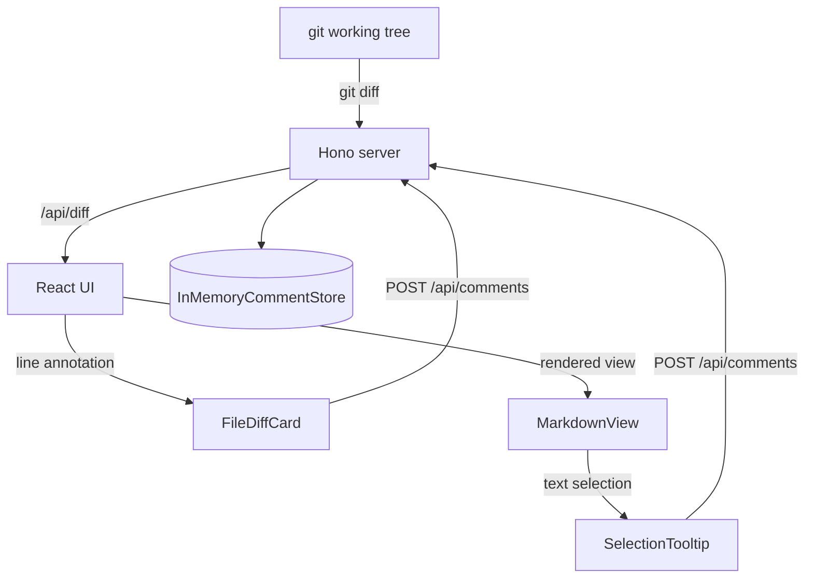

# Architecture Overview

diffx is a local code review tool that runs a lightweight Hono web server serving a React UI over your git working tree.

## Request Flow

## Comment Types

There are two kinds of review comments:

**Line comments** anchor to a specific line in the diff — the same model GitHub uses. You click the `+` gutter button next to any changed line.

**Rendered comments** anchor to selected text in the rendered markdown view — the same model Google Docs uses. You select a passage, hit the floating `+`, and your comment appears in the right margin connected to the highlighted text.

## Key Components

| Component | Responsibility |
|-----------|---------------|
| `FileDiffCard` | Diff/Rendered toggle + line comment flow |
| `MarkdownView` | Rendered markdown + Google Docs comment flow |
| `MermaidBlock` | Lazy-loaded Mermaid diagram renderer |
| `RenderedCommentMargin` | Right-side margin with aligned comment bubbles |
| `SelectionTooltip` | Floating `+` that appears on text selection |
| `GhostPlusButton` | Ghost `+` pinned to the start line during a gutter drag |
